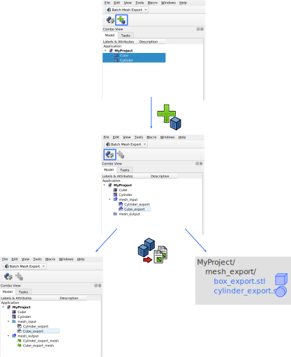
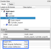

# FreeCAD Batch Mesh Export

A [FreeCAD](https://github.com/FreeCAD) add-on that lets you meshify and export all your parts, with one click.
This allows for a streamlined workflow, e.g. for 3D printing.

## Description
This add-on provides a new workbench with two commands. 
When you invoke the commands it will create two groups: *mesh_input* and *mesh_output*. (You can also create the groups yourself, but make sure to name them correctly.) Objects that are inside *mesh_input* will each get converted to a mesh and subsequently will be exported to an STL file.

By clicking this icon (or pressing `Ctrl+Shift+A`)

links are created to the selected objects and put inside *mesh_input*.

By clicking this icon (or pressing `F5`)

all parts in the group *mesh_input* get converted into mesh objects in the group *mesh_output*.
In addition each mesh will be exported to an STL file in the folder `<ActiveDocument>/mesh_export/`.

The following graphic summarizes these commands with a small example.

The *BatchExport* command uses the standard tesselation algorithm of FreeCAD's [Mesh Workbench](https://wiki.freecadweb.org/Mesh_Workbench).
As shown below the *mesh_input* group will contain a number of tesselation parameters which you can adjust to change the resolution of the generated meshes. The parameter *Export STL* can be set to `false` to skip the file export (only create meshes).

## Installation
To install the latest version, simply clone this repository or download the release to your local `Mod` directory, located at
* **Linux**: `~/.FreeCAD/Mod` (sometimes also `~/.local/share/FreeCAD/Mod`)
* **Windows**: `C:\Users\<your_user_name>\AppData\Roaming\FreeCAD\Mod`
* **MacOSX**: `/home/<your_user_name/Library/Preferences/FreeCAD/Mod`
